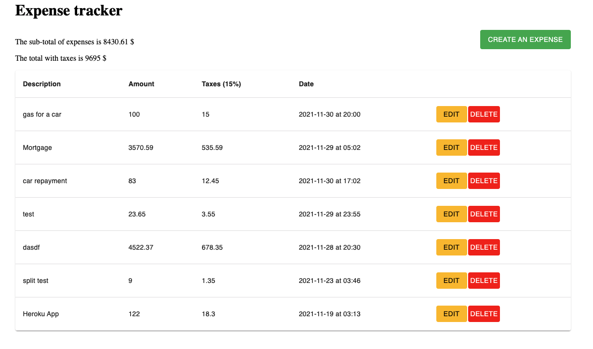
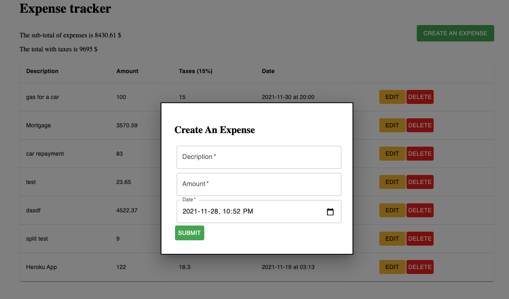
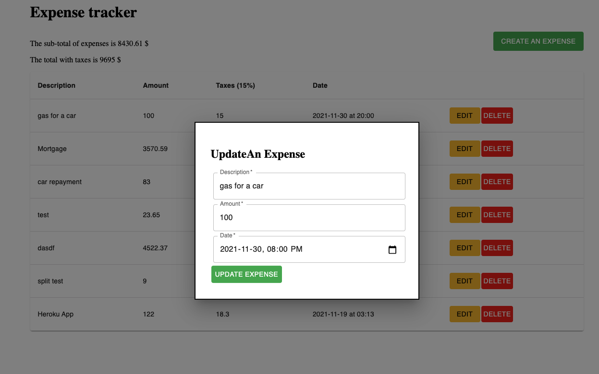
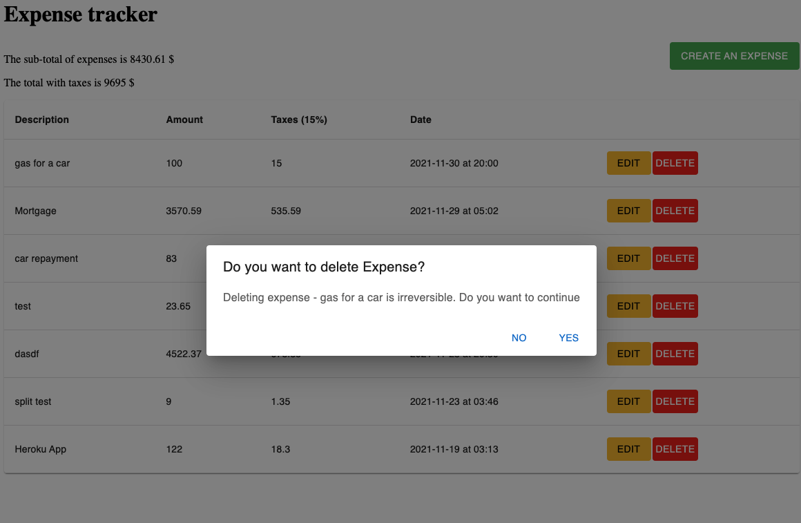

# DynaView

[](https://www.npmjs.com/package/example-typescript-react-component-library)

DynaView application which is dynamicly frontend challenge built with [TypeScript](https://github.com/Microsoft/TypeScript) and [Reactjs](https://reactjs.org)

## Project structure

The project contains a `src` directory which is where majority of our application resides with an entry point `index.tsx` at the root directory of our project
<br />

| Folder  | Description                                                      |
| :------ | :--------------------------------------------------------------- |
| actions | https requests to the serverand dispatches actions               |
| reducer | update app state of the redux store when an action is dispatched |
| Modules | App Components                                                   |
| util    | App varaibles for server connection                              |

]

```sh
# Install apllication dependencies
npm install

```

## Development

```sh
# Run Locally
npm start

```

## Application Snippet

### Landing page



### Create an expense



### Update an expense



### Delete an expense


